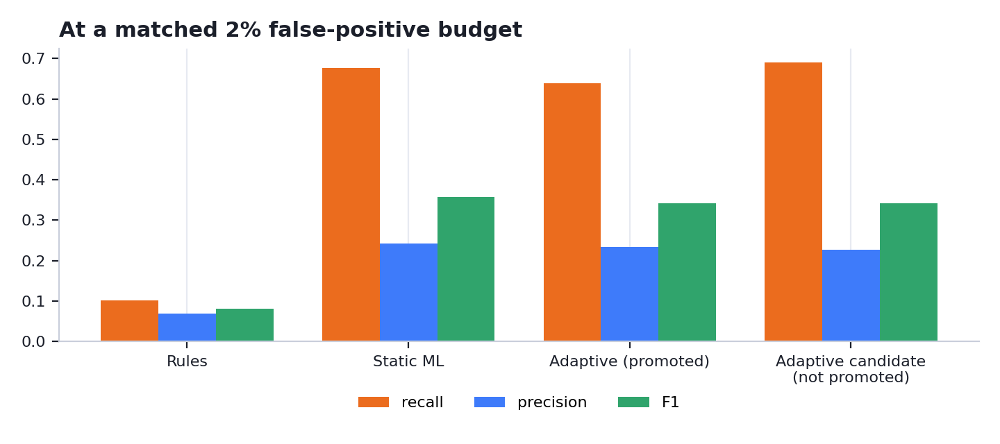
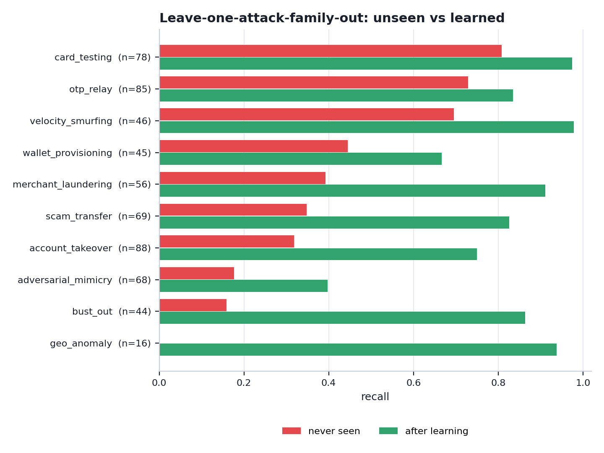
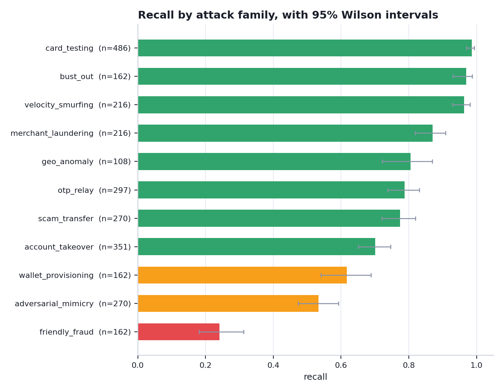
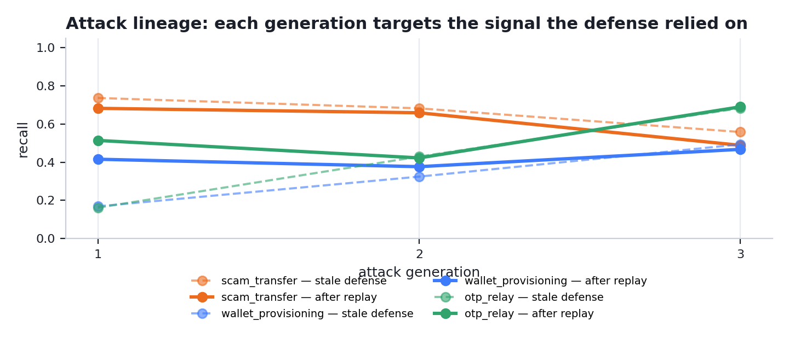
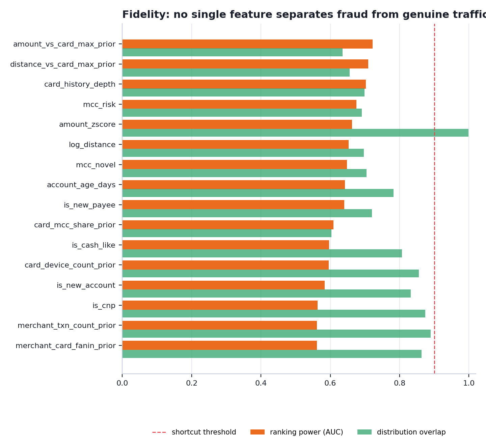
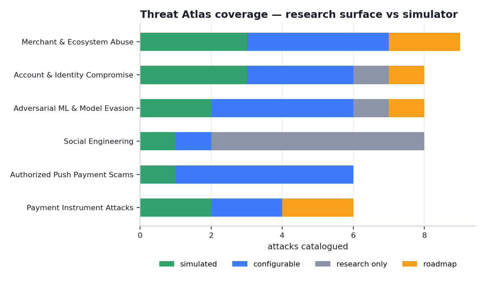

# 🛡️ AI Defense Lab for Adaptive Payment Fraud

**A closed-loop GenAI red team / blue team laboratory for discovering, simulating and defending against emerging payment fraud.**

*Mastercard Innovation Challenge 2026 · GFF Mumbai*

```
DISCOVER  →  SIMULATE  →  ATTACK  →  DETECT  →  ADAPT
```

> Traditional fraud systems mostly learn from fraud that has already happened. This lab actively searches for what the current defense does not know, generates realistic adversarial payment behaviour, stress-tests the model against it, and converts every discovered weakness into training data for the next defense.

**All data is synthetic. Every number below is a simulation result, regenerated by `python -m src.pipeline` from a single seed. Nothing here has been validated on real payment data, and nothing here has been reviewed or validated by Mastercard.**

---

## Run it

```bash
python -m pip install -r requirements.txt
streamlit run app/Home.py
```

Demo mode is the default: every page renders from committed artifacts. No API key, no network access, no training on stage.

```bash
python -m src.pipeline          # regenerate every artifact
python -m src.pipeline --fast   # everything except the closed loop
python -m pytest tests/ -q      # test suite
python -m docs.build_docs       # regenerate README + walkthrough from artifacts
```

---

## Headline results

| Metric | Value |
|---|---|
| Recall | 67.6% |
| Precision | 0.242 |
| F1 | 0.357 |
| PR-AUC | 0.500 |
| ROC-AUC | 0.953 |
| False-positive rate | 1.97% (budget ≤ 2%) |
| False positives per 1,000 genuine payments | 19.7 |
| Held-out test set | 37,500 transactions, 346 fraudulent |

Precision is naturally modest at a 1.2% base rate. The answer is tiered decisioning — challenge, do not decline — not a bigger number. PR-AUC leads because ROC-AUC flatters problems this imbalanced.

### Rules vs static ML vs adaptive defense

Compared at a **matched false-positive budget** on the same held-out split. Comparing detectors at whatever operating point each happens to sit on is close to meaningless — any of them can buy recall by challenging more genuine customers.

| Detector | Recall | Precision | F1 | FPR | FP / 1,000 genuine |
|---|---|---|---|---|---|
| Rules baseline | 10.1% | 0.068 | 0.081 | 1.29% | 12.9 |
| Static ML | 67.6% | 0.242 | 0.357 | 1.97% | 19.7 |
| Adaptive (promoted) | 63.9% | 0.233 | 0.341 | 1.96% | 19.6 |
| Adaptive candidate (not promoted) | 69.1% | 0.227 | 0.342 | 2.19% | 21.9 |

The rule set is deliberately competent, not a strawman: it includes the network-level rules a real fraud team would write once it had the same counters the model gets. Its thresholds are round, domain-chosen numbers, never fitted to this dataset. Matched thresholds are selected on the validation slice and applied unchanged to the test slice, so no detector gets to see the answer before choosing where to sit.

**On the adaptive model's numbers here:** this table scores every detector on the *original* attack distribution, which is the static model's home ground — it was trained on exactly this. The adaptive model is trained on that data plus several generations of evolved attacks, so on the original distribution it is at best comparable. Its advantage is robustness to attacks that have moved, which is measured on the Closed Loop page against each evolved generation, not here.



### What adaptation actually buys — the evolved attacks

Every comparison above scores detectors on the *original* attack distribution, which is the static model's home ground. The question adaptation exists to answer is what happens once the attack has moved. Both models below are scored on the same unseen frame of the **final evolved generation** (2703 fraudulent transactions, seed unseen by either model):

| Defense | Mean recall on evolved attacks | FPR | By family |
|---|---|---|---|
| Static defense (never saw the evolved attack) | 49% | 1.97% | scam_transfer 74% (n=483)  ·  wallet_provisioning 42% (n=290)  ·  otp_relay 33% (n=531) |
| Adaptive defense (trained through the loop) | 48% | 0.97% | scam_transfer 38% (n=483)  ·  wallet_provisioning 39% (n=290)  ·  otp_relay 68% (n=531) |
| Promoted champion | 51% | 1.25% | scam_transfer 56% (n=483)  ·  wallet_provisioning 42% (n=290)  ·  otp_relay 55% (n=531) |

The static defense is the model trained before the loop ran — it has never seen these evolved variants. The adaptive defense is the same architecture trained through the loop on cumulative adversarial replay. Both are scored on the same unseen frame of the FINAL evolved generation, and both are additionally re-thresholded to spend the same false-positive budget, with that threshold chosen on a separate generation-0 frame. The matched numbers are the comparable ones.

**Read the trade, not just the mean.** Adaptation bought **otp_relay** 33% → 55%. It gave up **scam_transfer** 74% → 56%. The families the red team actually attacked are the ones that moved; a single mean across families would hide both halves of that, which is why the per-family numbers are printed next to it.

### The hero result — unseen → learned

With **bust out** removed from training entirely, the defense caught **16%** of it. After the lab generated that family and replayed it into training: **86%** (n=44 held-out transactions, 95% interval 73–94%).

This family is chosen automatically as the largest measured gain among families with at least 30 held-out examples. Families below that floor appear in the table below, marked, and are never used as the headline — a wide interval cannot carry one, however good the point estimate looks.

This measures **unseen → learned adaptation on synthetic data**. It is not a zero-shot detection claim, and `after learning` is an upper bound obtained by putting the family directly into training — the closed loop has to *reach* that bound by generating the family itself.



| Family | Never seen | 95% interval | After learning | 95% interval | n |
|---|---|---|---|---|---|
| geo_anomaly * | 0% | 0–19% | 94% | 72–99% | 16 |
| bust_out | 16% | 8–29% | 86% | 73–94% | 44 |
| merchant_laundering | 39% | 28–52% | 91% | 81–96% | 56 |
| scam_transfer | 35% | 25–47% | 83% | 72–90% | 69 |
| account_takeover | 32% | 23–42% | 75% | 65–83% | 88 |
| velocity_smurfing | 70% | 55–81% | 98% | 89–100% | 46 |
| wallet_provisioning | 44% | 31–59% | 67% | 52–79% | 45 |
| adversarial_mimicry | 18% | 10–28% | 40% | 29–52% | 68 |
| card_testing | 81% | 71–88% | 97% | 91–99% | 78 |
| otp_relay | 73% | 63–81% | 84% | 74–90% | 85 |

`*` geo_anomaly — fewer than 30 held-out examples. Shown for completeness and deliberately **not** used as the hero result: the interval is far too wide to carry a headline, however good the point estimate looks. The hero above is chosen automatically from the families that clear the sample-size floor.

### Recall by attack family

Measured on an unseen, fraud-enriched frame (90,000 transactions, 2700 fraudulent) generated from a seed no model was trained or tuned on, so every family has enough held-out examples for its number to mean something.

| Family | Recall | n | 95% interval |
|---|---|---|---|
| card_testing | 99% | 486 | 97–99% |
| bust_out | 97% | 162 | 93–99% |
| velocity_smurfing | 96% | 216 | 93–98% |
| merchant_laundering | 87% | 216 | 82–91% |
| geo_anomaly | 81% | 108 | 72–87% |
| otp_relay | 79% | 297 | 74–83% |
| scam_transfer | 77% | 270 | 72–82% |
| account_takeover | 70% | 351 | 65–75% |
| wallet_provisioning | 62% | 162 | 54–69% |
| adversarial_mimicry | 53% | 270 | 47–59% |
| friendly_fraud | 24% | 162 | 18–31% |

Families whose fraud is **authorized by the genuine customer on their own device** — first-party dispute abuse, and scams the victim was talked into — sit at the bottom by construction. There is very little to see at authorization time. The correct control for those is friction, payee-risk intelligence and post-transaction recall, not a hard decline. They are reported rather than quietly excluded.



### The closed loop

Targets are chosen from the defense's **measured** weakest families (scam_transfer, wallet_provisioning, otp_relay), not decided in advance. Families whose fraud is authorized by the genuine customer are measured but not attacked further: their limit is observability, not the decision boundary.

| Round | Family | Signal targeted | Stale defense | After replay | Status | n |
|---|---|---|---|---|---|---|
| 1 | scam_transfer | mcc_risk | 74% | 68% | partial | 129 |
| 1 | wallet_provisioning | mcc_risk | 17% | 42% | residual_frontier | 77 |
| 1 | otp_relay | mcc_risk | 16% | 51% | residual_frontier | 142 |
| 2 | scam_transfer | residual amount signal | 68% | 66% | partial | 129 |
| 2 | wallet_provisioning | is_cnp | 32% | 38% | residual_frontier | 77 |
| 2 | otp_relay | residual amount signal | 43% | 42% | residual_frontier | 142 |
| 3 | scam_transfer | residual velocity signal | 56% | 49% | residual_frontier | 129 |
| 3 | wallet_provisioning | log_amount | 49% | 47% | residual_frontier | 77 |
| 3 | otp_relay | residual velocity signal | 68% | 69% | partial | 142 |

**Governance:** every adapted model is a challenger measured against the model in force, and ships only if it clears every promotion gate. In this run round(s) [1] were promoted.



---

## Architecture

```
Emerging fraud intelligence
        ↓
Threat Atlas          identify / threat ideation
        ↓
Red-team agent        structured attack specification
        ↓
Constraint layer      payment-domain rules: clamp or reject
        ↓
Constrained simulator synthetic payment stream
        ↓
Defense model         authorization-time features only
     ↙        ↘
detected    escaped
                ↓
       Weakness analysis   which signal did it rely on?
                ↓
       Attack evolution
                ↓
       Adversarial replay
                ↓
       Retrain → champion/challenger gate → ↺
```

### Where generative AI actually contributes

The language model **never writes transactions**. It writes a *specification*:

```json
{
  "attack_family": "account_takeover",
  "strategy": "reuse the victim's trusted device, change merchant behaviour",
  "amount_profile": "moderate",
  "velocity_profile": "low_and_slow",
  "device_behavior": "trusted_device",
  "merchant_behavior": "new_high_risk_merchant",
  "geo_behavior": "plausible",
  "targets_signal": "device_changed",
  "confidence": 0.82
}
```

That specification is validated against payment-domain constraints — an authorized push payment scam cannot run from an attacker's device, because the genuine customer is the one authenticating — and anything impossible is clamped or refused before a single row is generated. A deterministic, seeded simulator then executes what survives.

### Two paths, and which one produced the committed numbers

**Demo mode uses deterministic, committed specifications.** That is a reliability decision, not a limitation: the prototype has to run on stage with no API key, no network and no training, and every committed figure has to be reproducible from a single seed. So every specification in `models/attack_lineage.json` carries `spec_source: "heuristic"` and every content artifact carries `source: "template"`. The weakness-driven heuristic reads the same measured evidence and moves the same dials, which is why the behaviour being demonstrated is the loop's rather than a single model call's.

**The optional GenAI red team generates the specification instead.** With `ANTHROPIC_API_KEY` set, the language model receives the measured weakness and returns the structured specification, which then goes through exactly the same payment-domain constraint layer before anything is simulated — same validation, same clamping, same refusals. Specifications produced that way are stamped `spec_source: "llm"`, so the two are never confused in the artifacts.

```bash
python -m src.generate.demo_specs --check   # report readiness
python -m src.generate.demo_specs           # 5 live specs -> models/genai_spec_demo.json
```

That script demonstrates the live path on five safe synthetic seeds without touching the dataset, the models or any committed metric. With no key it writes nothing and says so, rather than quietly substituting heuristic output for a model response.

---

## Is the synthetic data worth training on?

If any single field separated fraud from genuine traffic cleanly, the detector would be learning the generator rather than fraud, and every number above would be meaningless. So it is measured, not asserted:

| Check | Result | Detail |
|---|---|---|
| no single feature separates classes | PASS | strongest single feature is amount_vs_card_max_prior at AUC 0.722 (fail at 0.9) |
| no feature near perfect separation | PASS | none above the warning line |
| legit device changes exist | PASS | 15.791% of genuine transactions change device |
| legit new payees exist | PASS | 41.5% of genuine transactions are a first visit to that merchant |
| fraud sometimes uses a known device | PASS | 78.6% of fraud runs from a device the card had used before |
| fraud sometimes reuses a merchant | PASS | 30.5% of fraud is a repeat visit to the same merchant |
| fraud amounts overlap legit range | PASS | 32.2% of fraud sits inside the genuine inter-quartile amount range (INR 595-4,462) |
| no history is not a fraud synonym | PASS | first-ever transaction: 3.9% of genuine vs 15.1% of fraud (ratio 3.9x) |
| fraud timing is not uniformly nocturnal | PASS | night-time share: 13.1% genuine vs 17.1% fraud |
| family sample sizes support their claims | PASS | all families at or above the reporting floor |
| fraud actors have cover traffic | PASS | 667 legitimate-looking transactions were generated by fraud actors (mule grooming, bust-out ramp-up, front-merchant sales) |

Strongest single feature: **amount_vs_card_max_prior** at AUC 0.722. 0 failing checks, 0 warnings.



---

## The Threat Atlas

**45 attacks** across **6 fraud surfaces** and 6 payment rails. Deliberately wider than the simulator, and labelled so the difference is visible:

| Status | Count | Meaning |
|---|---|---|
| IMPLEMENTED | 12 | a dedicated injector reproduces its authorization footprint |
| PARAMETERIZED | 19 | reachable today by configuring an existing injector, no new code |
| RESEARCH_ONLY | 8 | characterized but **not** simulated |
| FUTURE | 6 | named as planned simulator work |

| Fraud surface | Total | Simulated |
|---|---|---|
| Merchant & Ecosystem Abuse | 9 | 7 |
| Account & Identity Compromise | 8 | 6 |
| Adversarial ML & Model Evasion | 8 | 6 |
| Social Engineering | 8 | 2 |
| Authorized Push Payment Scams | 6 | 6 |
| Payment Instrument Attacks | 6 | 4 |

23 of the 45 catalogued attacks have low or no visibility at authorization time. Saying so is the point: an authorization-time model is the wrong control for most of them.



---

## What it costs to run

Applied to a declared scenario of 10,000,000 monthly authorizations:

| Measure | Value |
|---|---|
| False positives per 1,000 genuine payments | 19.7 |
| Genuine customers sent to step-up | 2.40% |
| Genuine customers declined | 0.100% |
| Fraud sent to friction | 71% |
| Monthly step-up challenges | 274,400 |
| Analyst-hours if every challenge were reviewed by hand | 10,976 |

*synthetic illustrative scenario — not production economics.* Volumes are derived by applying measured rates to the declared synthetic scenario. They illustrate what a false-positive rate costs operationally; they are not a forecast for any real portfolio.

---

## Repository

```
config.py                     paths, seeds, archetypes, bounds, gates
src/identify/                 Threat Atlas catalog + loader
src/generate/attack_spec.py   structured specs + constraint layer
src/generate/profiles.py      customer archetypes, merchant profiles
src/generate/base_generator.py legitimate transaction stream
src/generate/attack_injectors.py  one injector per simulated family
src/generate/fidelity.py      synthetic fidelity diagnostics
src/generate/llm_agent.py     red-team agent (specs + content)
src/defend/features.py        authorization-time feature contract
src/defend/model.py           GBM + isolation forest + calibration
src/defend/baseline.py        rules baseline + matched-FPR comparison
src/defend/diagnostics.py     thresholds, calibration, operations, blind spots
src/defend/governance.py      champion/challenger gates + registry
src/loop/weakness.py          weakness analysis + mutation proposals
src/loop/redteam_loop.py      the closed loop
src/experiments/leave_one_out.py  unseen → learned experiment
app/                          Streamlit prototype
docs/build_docs.py            regenerates README + walkthrough
tests/                        data-quality, leakage and behaviour tests
```

---

## Limitations

- **Synthetic only.** No real cardholder data. Every number is a simulation result, and a real deployment needs a labelled backtest on issuer data before any of it means anything.
- **Some fraud is not observable at authorization time.** First-party abuse and victim-authorized scams are intentionally hard here and reported with low recall; they belong to behavioural monitoring and post-transaction intervention.
- **Residual frontiers remain.** Attacks that sit on the legitimate behavioural centroid are not solved; the loop surfaces them rather than hiding them.
- **The text arm is a sanity check, not a result, and is never used as evidence of detection efficacy.** Its corpus is composed from a fixed slot vocabulary, so the two classes separate on vocabulary alone and the score is trivially high. It measures the corpus, not the detector, and would not survive contact with real scam messages. Every detection claim in this project rests on the transaction model alone.
- **No shadow rollout, drift monitoring or analyst feedback loop** — all three are required in production and none is simulated.
- **Nothing here has been reviewed or validated by Mastercard.**

## Reproducibility

Everything flows from `config.GLOBAL_SEED = 42` (schema version 2.0). Language-model calls are cached by prompt hash, so committed runs are stable and the app runs network-free. `python -m src.pipeline` reproduces every artifact, and `python -m docs.build_docs` regenerates this README and the walkthrough from those artifacts — no figure in either document is typed by hand.

---

**Docs:** [`docs/DEMO_SCRIPT_90S.md`](docs/DEMO_SCRIPT_90S.md) · [`docs/JUDGE_QA.md`](docs/JUDGE_QA.md) · [`docs/PITCH_3MIN.md`](docs/PITCH_3MIN.md) · [`docs/DEMO_GUIDE.md`](docs/DEMO_GUIDE.md) · `docs/solution_walkthrough.docx`
